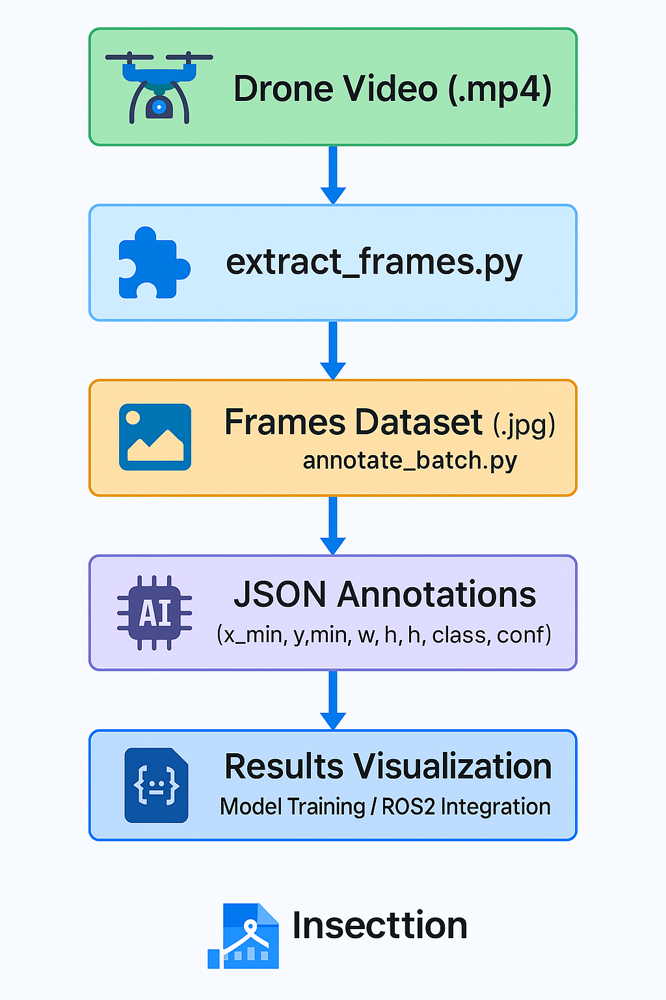
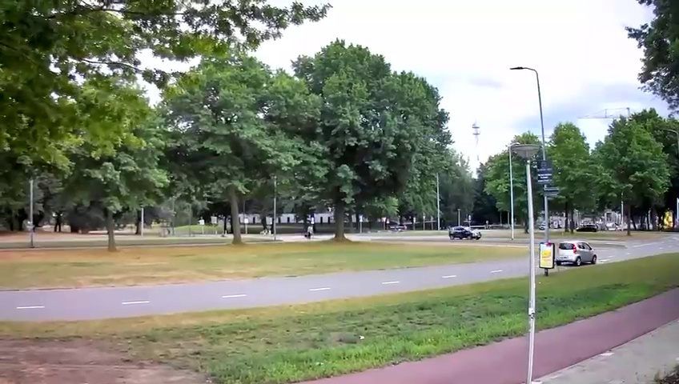
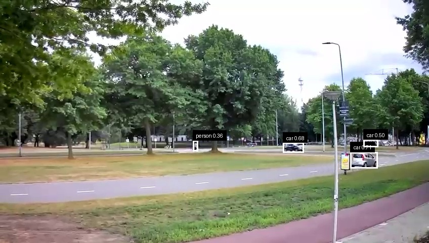

# 🛰️ DroneSensors YOLOv8 Project

**Auteur :** Oualid Allouch  
**Entreprise :** VTEC Lasers & Sensors Ltd. (Eindhoven, NL)  
**Rôle :** AI & Computer Vision Intern — Juin–Août 2025  

---

## 🧠 Pipeline global

<p align="center">
  
</p>

---

## 🎯 Objectif

Pipeline IA de bout en bout pour l’analyse de **vidéos de drones** en **surveillance environnementale** :

- Extraction automatique de frames depuis des vidéos  
- Détection & annotation avec **YOLOv8** (Ultralytics)  
- Export des résultats au format **JSON** (prêt pour l’entraînement ou l’évaluation)

---

## 📦 Structure

```bash
drone_yolov8_project/
├── src/
│   ├── annotate.py          # Inference / annotation YOLOv8
│   ├── utils.py             # Fonctions utilitaires
│   └── __init__.py
│
├── scripts/
│   ├── extract_frames.py    # Extraction des frames depuis .mp4
│   ├── annotate_batch.py    # Annotation en batch -> JSON
│   └── visualize_json.py    # Visualisation des annotations
│
├── data/                    # Datasets (échantillons légers)
├── annotations/             # JSONs générés
├── results/                 # Logs & résultats
├── docs/                    # Documentation et exemples visuels
│   ├── pipeline_overview.png
│   ├── original_frame.jpg
│   ├── example_annotation.jpg
│   └── video2.mp4_frame0156.json
│
├── Makefile
├── requirements.txt
└── README.md
```
🖼️ Exemple d’annotation YOLOv8
|                            Image originale                            |                              Image annotée                              |
| :-------------------------------------------------------------------: | :---------------------------------------------------------------------: |
|  |  |


📄 Exemple d’annotation JSON
```json
{
  "image_filename": "video2.mp4_frame0156.jpg",
  "image_dimensions": { "width": 848, "height": 480 },
  "objects": [
    {
      "contour": { "x": 692.77, "y": 300.01, "w": 53.49, "h": 32.49 },
      "obj_name": "car",
      "name_accuracy": 0.7056
    },
    {
      "contour": { "x": 559.83, "y": 281.91, "w": 40.72, "h": 19.37 },
      "obj_name": "car",
      "name_accuracy": 0.6810
    },
    {
      "contour": { "x": 718.60, "y": 275.97, "w": 28.55, "h": 14.71 },
      "obj_name": "car",
      "name_accuracy": 0.4981
    },
    {
      "contour": { "x": 381.34, "y": 277.32, "w": 9.75, "h": 21.29 },
      "obj_name": "person",
      "name_accuracy": 0.3576
    }
  ]
}
```
📁 Voir le fichier complet video2.mp4_frame0156.json

---

## ⚙️ Installation rapide

🧩 Installation de l’environnement et des dépendances :

```bash
# 1️⃣ Créer et activer l'environnement virtuel
python -m venv .venv
source .venv/bin/activate

# 2️⃣ Installer les dépendances requises
pip install -r requirements.txt
```
## 🔁 Reproduire les résultats

1️⃣ Ajouter une vidéo drone

Dépose un fichier .mp4 dans le dossier suivant :
```bash
data/videos/

```
2️⃣ Extraire les frames à partir de la vidéo
```bash
python scripts/extract_frames.py data/videos data/frames_dataset 10

```
➡️ Cela extrait une image toutes les 10 frames (modifiable selon besoin).

3️⃣ Annoter automatiquement les frames avec YOLOv8
```bash
python scripts/annotate_batch.py data/frames_dataset annotations

```
🧠 Les résultats d’annotation sont enregistrés sous forme de fichiers JSON dans annotations/.

4️⃣ Visualiser une annotation à partir d’un fichier JSON
```bash
python scripts/visualize_json.py \
  docs/original_frame.jpg \
  docs/video2.mp4_frame0156.json \
  docs/example_annotation.jpg

```
📸 Cette commande charge l’image originale, applique les annotations JSON,
et sauvegarde le rendu dans docs/example_annotation.jpg.

## 🧰 Technologies utilisées

🐍 Python 3.12

🧠 YOLOv8 (Ultralytics)

🎥 OpenCV

🧾 JSON Annotation

⚙️ ROS2 / Jetson compatible

🧩 Linux, Git, Bash

## 🔗 Contact

👨‍💻 Oualid Allouch
AI & Computer Vision Engineer
📍 Télécom Physique Strasbourg | VTEC Lasers & Sensors (Eindhoven, NL)

📫 Email : oualid.allouch@etu.unistra.fr

🌐 LinkedIn:(https://www.linkedin.com/in/oualid-allouch-608b3738a/)


